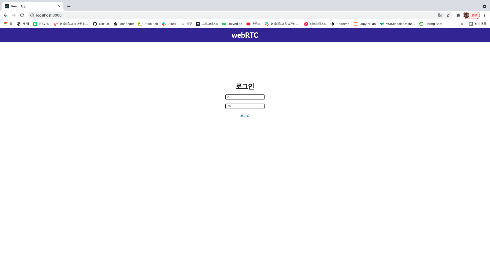
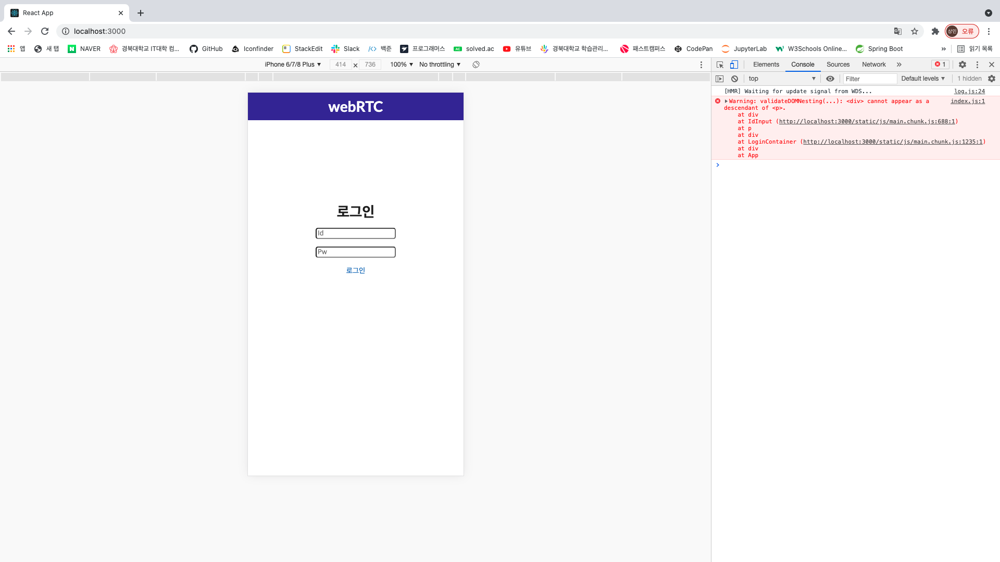
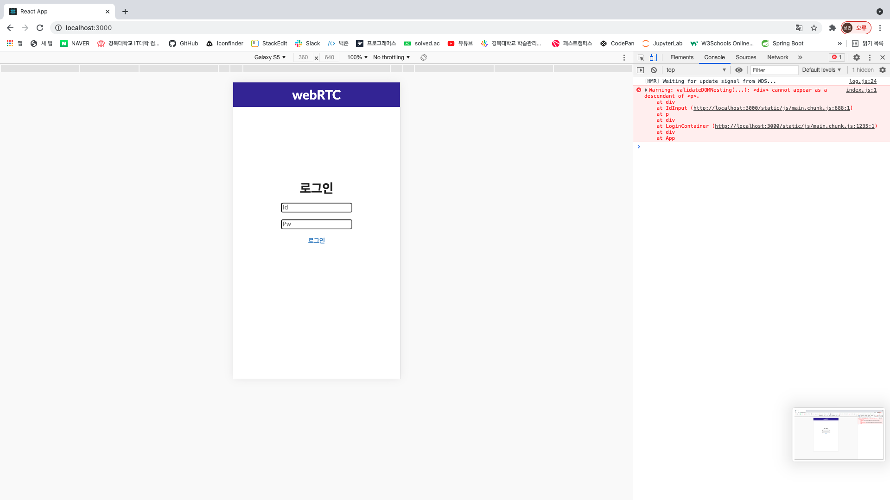
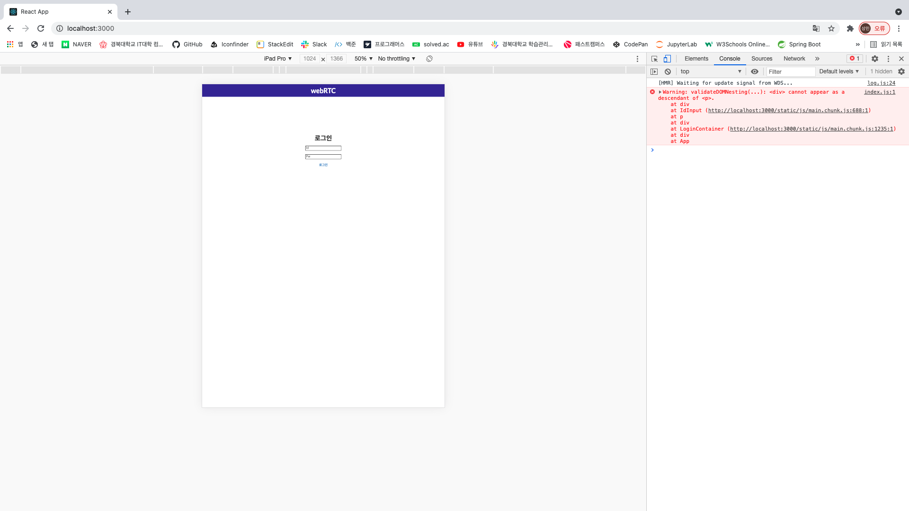

[무료 도메인 및 router53](https://st-soul.tistory.com/6)

[로드밸런서 및 https 요청](https://helloinyong.tistory.com/149)

[Route53 + ACM](https://dev.classmethod.jp/articles/route53-acm-free-domain-https-certification/)

ssh -i "<your pem key name>.pem" ubuntu@<your IPv4 Public IP>
  
HTTPS=ture npm start

https://isolution.pro/ko/q/au14230984/ubuntu-20-04-naj-eun-ssl-boan-sujun-eul-seoljeonghaneun-bangbeob-eun-mueos-ibnikka

https://minhanpark.github.io/today-i-learned/apply-https/

로드밸런서, 무료도메인, Route53, ACM, 버지니아 동부
