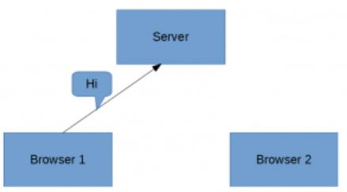
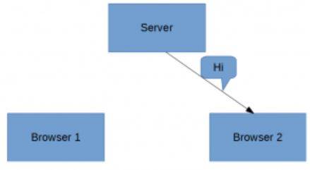
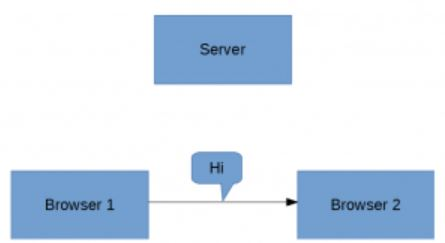

# Guide to WebRTC를 읽으면서 정리한 것들.

링크 : https://www.baeldung.com/webrtc

---

## 목차

- [Guide to WebRTC를 읽으면서 정리한 것들.](#guide-to-webrtc를-읽으면서-정리한-것들)
  - [목차](#목차)
  - [- Sending a Message](#--sending-a-message)
  - [Overview](#overview)
  - [Fundamentals anc Concepts of WebRTC](#fundamentals-anc-concepts-of-webrtc)
    - [보통의 커뮤니케이션](#보통의-커뮤니케이션)
  - [Support for WebRTC and Built-In Features(내장 기능 지원)](#support-for-webrtc-and-built-in-features내장-기능-지원)
  - [Peer-to-Peer Connection](#peer-to-peer-connection)
  - [Signaling](#signaling)
    - [Building the Signaling Server](#building-the-signaling-server)
    - [Creating Message Handler in Signaling Server](#creating-message-handler-in-signaling-server)
  - [Exchanging Metadata](#exchanging-metadata)
  - [Setting Up the Client](#setting-up-the-client)
  - [Setting Up a Simple RTCDataChannel](#setting-up-a-simple-rtcdatachannel)
  - [Establishing a Connection With ICE](#establishing-a-connection-with-ice)
    - [Creating an Ofter](#creating-an-ofter)
    - [Handling ICE Candidates](#handling-ice-candidates)
    - [Receiving the ICE Candidate](#receiving-the-ice-candidate)
    - [Receiving the Offer](#receiving-the-offer)
    - [Receiving the Answer](#receiving-the-answer)
  - [Sending a Message](#sending-a-message)
---

## Overview

2개의 브라우저가 커뮤니케이트가 필요할 때, 보통 그들 사이 메세지를 주고받기 위한 커뮤니케이션의 협력 사이인 서버가 필요하다.

그러나 중간에 서버를 보유하는 것은 브라우저들간 커뮤니케이션에서 delay를 야기한다.

여기서 WebRTC는 브라우저와 모바일 applications에서 실시간으로 서로 직접 커뮤니케이트할 수 있게 해준다.

여기에서는 HTML, JavaScript 및 WebSocket 라이브러리를 웹 브라우저에 내장된 WebRTC 지원과 함께 사용하여 client를 구축할 것이다.

그리고, WebSocket을 통신 프로토콜로 사용하는 Spring Boot로 Signaling Server를 만들 것이다.

마지막으로, 이 연결에 비디오 및 오디오 스트림을 추가하는 방법을 알아볼것이다.

---

## Fundamentals anc Concepts of WebRTC

### 보통의 커뮤니케이션

WebRTC 없이 2개의 브라우저 간 전형적인 커뮤니케이션을 어떻게 하는지 살펴 보겠다.

2개의 브라우저가 있다고 가정하고, Browser 1은 Brower2에게 메세지를 보낼기 원할때, 그러면 아래와 같이 Browser1은 Server에세 먼저 메세지를 보낸다.

- 

Server가 메세지를 받은 후, 그것을 처리하고, Browser2를 찾고, message를 아래와 같이 보낸다.
- 

이때, browser2에게 메세지를 보내기 전 Server에서 가공하기 때문에, 커뮤니케이션은 거의 실시간으로 이루어진다. 물론, 여기서 진짜 real-time으로 이루어지길 원한다.

WebRTC는 두 브라우저 사이에 직접 채널을 만들어 server의 필요성을 없애줌으로써 이 문제를 해결한다.
- 

결과적으로, 메시지가 sender에서 receiver로 직접 라우팅되므로 한 브라우저에서 다른 브라우저로 메시지를 전달하는 데 걸리는 시간이 크게 단축된다.

---

## Support for WebRTC and Built-In Features(내장 기능 지원)

WebRTC는 Chrome, ... 뿐 아니라 Android, iOS 지원된다.

**WebRTC는 브라우저와 함께 즉시 제공되는 solution이기 때문에 브라우저에 외부 플러그인을 설치 안해도 된다.**

게다가, 전형적인 영상 오디오 전송을 가지는 real-time application에서, 보통 C++ 라이브러리에 강하게 의존하며, 이에따라 아래와 같이 많은 문제들이 있다.
```
Packet-loss concealment
Echo cancellation
Bandwidth adaptivity
Dynamic jitter buffering
Automatic gain control
Noise reduction and suppression
Image “cleaning”
```

**WebRTC는 이러한 모든 문제를 해결**하므로 client 간 실시간 커뮤니케이션을 보다 간편하게 수행할 수 있다.

---

## Peer-to-Peer Connection

P2P 연결에서 server에 대해 알려진 주소가 있고 client가 이미 통신할 server의 주소를 알고 있는 client-server와 다르게, **다른 peer에 대한 직접적인 주소를 가진 peer는 없다.**

이 p2p 연결을 설정하기 위해, client에서 다음을 허용해야한다.
```
1. 스스로 커뮤니케이션이 가능하도록 해야함.
2. 서로 식별이 되어야하고 네트워크 관련 정보를 공유해야함.
3. 관련된 data, mode, protocols 형식을 공유하게 동의해야함.
4. 데이터를 공유해야함.
```

WebRTC는 이러한 단계들을 수행하기 위한 API와 methodologies(방법론)을 정의한다.

client가 서로 발견하고, 네트워크 세부 정보를 공유한 다음, data의 형식을 공유하기 위해 **WebRTC는 signaling이라는 메커니즘 사용.**

---

## Signaling

Signaling은 네트워크 검색, session 생성, session 관리, media-기능 메타데이터 교환과 관련된 processes를 말한다.

이것은 client들이 서로에 대해 미리 알아야 커뮤니케이션을 시작할 수 있기에 필수적이다.

이를 이루기 위해서는, **WebRTC는 signaling에 대한 표준을 특정하지 않고 개발자의 구현에 맡긴다.**

### Building the Signaling Server

signaling server의 경우, Spring Boot를 사용하여 WebSocket server를 구축하겠다. Spring Initializer에서 생성된 empty Spring Boot 프로젝트로 시작할 수 있다.

구현에 WebSocket을 사용할려면 아래와 같은 의존관계를 가진다.(xml)
```xml
<dependency>
    <groupId>org.springframework.boot</groupId>
    <artifactId>spring-boot-starter-websocket</artifactId>
    <version>2.4.0</version>
</dependency>
```

signaling server 구현은 간단함
- client application이 WebSocket 연결로 등록하는 데 사용할 수 있는 endpoint를 만든다.
- 이것을 Spring Boot에서 하기 위해서는 아래와 같이 해야함.
- @Configuration, implements WebSocketConfigurer, override registerWebSocketHandlers method
- 
```java
@Configuration
@EnableWebSocket
public class WebSocketConfiguration implements WebSocketConfigurer {

    @Override
    public void registerWebSocketHandlers(WebSocketHandlerRegistry registry) {
        registry.addHandler(new SocketHandler(), "/socket")
          .setAllowedOrigins("*");
    }
}
```

다음 단계에서 빌드할 client에서 등록할 URL을 `/socket`으로 식별함.

또한, SocketHandler를 addHandeler method에 대한 argument로 전달함. - 이건 실제로 만들 메세지 헨들러임.(아래 내용)

### Creating Message Handler in Signaling Server

다음 단계는 여러 clients에서 받을 WebSocket 메시지를 처리하는 메시지 핸들러를 작성하는 것이다.

**이는 직접 WebRTC 연결을 설정하기 위해 다른 clients간 메타데이터 교환을 지원하기 위해 필수적이다.**

여기서는 단순하게, client로붙 메시지를 받으면, 그것을 자신을 제외한 다른 모든 clients에게 보낼 것이다.

이것을 하기위해서, Spring WebSocket library의 `extend TextWebSocketHandler`해야하고 `handleTextMessage`와 `afterConnectionEstablished` method를 override해야한다.

```java
@Component
public class SocketHandler extends TextWebSocketHandler {

    List<WebSocketSession>sessions = new CopyOnWriteArrayList<>();

    @Override
    public void handleTextMessage(WebSocketSession session, TextMessage message)
      throws InterruptedException, IOException {
        for (WebSocketSession webSocketSession : sessions) {
            if (webSocketSession.isOpen() && !session.getId().equals(webSocketSession.getId())) {
                webSocketSession.sendMessage(message);
            }
        }
    }

    @Override
    public void afterConnectionEstablished(WebSocketSession session) throws Exception {
        sessions.add(session);
    }
}
```

`afterConnectionEstablished` method에서 보듯이, 받은 session을 session 목록에 추가하여 모든 clientㄹ를 track 할 수 있다.

그리고 `handleTextMessage`에서 보이는 것 처럼 cliens로부터 메시지를 받으면, 우리는 list의 모든 clients sesions을 iterate하고 보낸사람의 session ID와 list의 session을 비교함으로써 보낸사람을 제외한 모든 clients에게 메시지를 보낸다.

--

## Exchanging Metadata

P2P connection에서, clients는 서로 매우 다를 수 있다. 예를들어, Android에서의 Chrome이 Mac에서의 Mozilla와 연결 할 수 있는것 처럼

그러므로, 이러한 장치들의 미디어 기능은 매우 다양할 수 있다. 따라서, Peer들간 handshake는 통신에 사용되는 미디어 유형과 코덱에 동의하는 것이 중요하다.

이러한 측면에서, **WebRTC는 clients간 metadat agree에 SDP(Session Description Protocol)를 사용한다.**

이를 이루기 위해, initiating peer는 다른 peer가 원격 descriptor로 반드시 설정해야 하는 offer를 만든다.

더하여, 다른 peer는 initiating peer에 의해 원격 descriptor로 허용되는 answer를 생성한다.

이 처리가 완료될때 connection이 설정된다.

---

## Setting Up the Client

initiating peer와 원격 peer의 역할을 모두 수행할 수 있도록 WebRTC client를 만든다.

`index.html`이라고 불리는 HTML filee과 `index.html`을 사용할 `client.js`라고 불리는 JavaScript file을 생성함으로써 시작한다.

signaling server에 연결하기 위해서, WebSocket 연결을 만든다. 

우리가 구축한 Spring Boot signaling server가 local에서 실행된다고 가정하면 아래와 같이 연결을 만들 수 있다.
```javascript
var conn = new WebSocket('ws://localhost:8080/socket');
```

signaling server에 message를 보내기 위해서, 다음 단계에서 메시지를 전달하기 위한 send method를 만들것이다.
```javascript
function send(message){
    conn.send(JSON.stringify(message));
}
```

---

## Setting Up a Simple RTCDataChannel

`client.js`에서 client를 setting 후, **RTCPeerConnection** class에 대한 object 생성이 필요하다.
```javascript
configuratoin = null;
var peerConnection = new RTCPeerConnection(configuratoin);
```

이 예제에서는, configuration object의 목적은 STUN(Session Traversal Utilities for NAT)과 TURN(Traversal Using Relays around NAT) servers 및 이 튜토리얼의 후반부에서 논의할 다른 configurations을 전달하는 것이다.

이 예제의 경우 null로 전달하면 충분함.

메시지 패싱에 사용할 `dataChannel`을 생성할 수 있다.

그 후에, data channel의 다양한 이벤트에 대한 listeners를 생성할 수 있다.

---

## Establishing a Connection With ICE

WebRTC connection를 구축하는 다음단계는 ICE(Interactive Connection Establishment) 와 SDP protocols을 포함되며, 여기서 peers의 session description은 두 peers에서 교환 및 승인(accept)된다.


signaling server는 peers 간 정보를 보내는 데 사용된다. 여기에는 clients가 signaling server를 통해 connection metadat를 교환하는 일련의 단계가 포함된다.

### Creating an Ofter

첫번째로, offer를 생성하고 이를 `peerConnection`의 local description으로 설정한다. 그런 다음 다른 peer에게 offer를 보낸다.
```javascript
peerConnection.createOffer(function (offer){
    send({
        event : "offer",
        data : offer
    });
    peerConnection.setLocalDescription(offer);
},function(error){
    //Handle error here
});
```

여기에, send method는 signaling server에 offer 정보를 전달하기 위해 call 해야한다.

### Handling ICE Candidates

두번째, ICE candidates handle이 필요하다.

**WebRTC는 connection을 구축하고 peers를 발견하는 ICE(Interactive Connection Establishment) protocol를 사용한다.**

`peerConnection`에서 local description을 설정할때, `icecandidate` event를 트리거한다.

이 event는 원격 peer가 해당 원격 peer에 추가할 수 있도록 해당 candidate를 원격 peer로 전송해야한다.

이것을 하기위해, `onicecandidate` event에 대한 listener를 만들어야한다.
```javascript
peerConnection.onicecandidate = function (event){
    if(event.candidate){
        send({
            event : "candidate",
            data : event.candidate
            });
    }
};
```

`icecandidate` event는 모든 candidates가 모이면 empty candidate string으로 다시 트리거된다.

이 cnadidate object를 원격 peer에도 전달해야 한다.

이 empty candidate string을 전달하여 원격 peer가 모든 icecandidate objects가 모였다는것을 알 수 있도록 해야한다.

또한, 동일한 event가 다시 트리거되어 ICE 후보 수집이 event에서 candidate object의 값을 null로 설정했음을 나타낸다. 이것은 원격 peer에 전달할 필요가 없다,

### Receiving the ICE Candidate

세번째, 다른 peer가 보낸 ICE CANDIDATE를 처리해야 한다.

원격 PEER는 이 candidate를 받은 후 해당 candidate pool에 추가해야한다.
```javscript
peerConnection.addIceCandidate(new RTCIceCandidate(candidate));
```


### Receiving the Offer

그 후, 다른 peer가 offer를 받았을 때, remote description을 설정해야 한다. 또한 initiating peer에 전송되는 answer(응답)을 생성해야 한다.

```javascript
peerConnection.setRemoteDescription(new RTCSessionDescription(offer));
peerConnection.createAnswer(function(answer) {
    peerConnection.setLocalDescription(answer);
        send({
            event : "answer",
            data : answer
        });
}, function(error) {
    // Handle error here
});
```

### Receiving the Answer

마지막으로, **initiating peer는 answer를 받고 원격 description으로 설정한다.**
```javascript
handleAnswer(answer){
    peerConnection.setRemoteDescription(new RTCSessionDescription(answer));
}
```

이렇게하면, WebRTC는 성공적인 연결이 구축된다.

지금부터, **signaling server없이 두 peers간 직접 data를 주고받을 수 있다,**

---

## Sending a Message

우리는 connection을 구축했고, **`dataChannel`의 send method를 사용하여 peers 간 메시지들을 보낼 수 있다.**

```javascript
dataChannel.sned("message");
```

마찬가지로, 다른 peer의 message를 받기 위해서는, `onmessage` event listener를 만들어야한다.
```javascript
dataChannel.onmessage = function(event){
  console.log("Message:",event.data);
};
```

data channel에서 message를 받기 위해서는, 우리는 또한 `peerConnection` object에 callbalk을 추가해야한다.
```javascript
peerConnection.ondatechannel = function(event){
  dataChannel = event.channel;
};
```

이러한 과정에서, 우리는 완전한 functional WebRTC data channel을 만들었다. 이제는 clients간 data를 주고 받고 할 수 있다. 추가적으로, 우리는 여기에 비디오와 오디오 channel을 추가할 수 있다.

---

Adding Video 