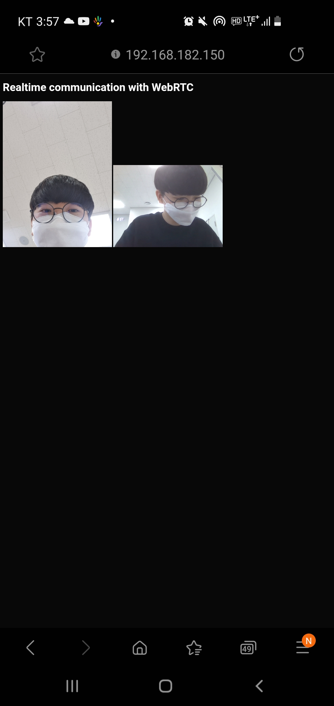

# Node.JS로 signaling server 구축 후 webRTC 사용

참고 사이트 : https://forest71.tistory.com/211

## 실행법 & 설명

시작에 앞서 Node.js가 설치되어 있어야한다.

지금 이 현재폴더에서 `cmd`창을 열어서 `npm i` 입력해서 실행에 필요한 라이브러리들을 설치한다.

그 후, `node index.js`를 입력하여 웹 서버 실행.

이제 SSL을 통하지 않으면 카메라(webRTC)를 이용할 수 없으므로 NodeJS에 SSL을 적용하기 위해 SSL을 생성.
> 지금 깃허브에는 혹시몰라서 private.pem과 public.pem을 올려두지 않았지만 아래 사이트참고해서 만들면 됨. 
> https://blog.naver.com/PostView.nhn?blogId=baekmg1988&logNo=221454486746  
> 그리고 아래와 같이 입력 
> `openssl genrsa 1024 > private.pem`  => OpenSSL로 개인키 파일 생성       
> `openssl req -x509 -new -key private.pem > public.pem`  => 개인키와 쌍이 되는 공개키 생성 

이 파일들을 `index.js`와 같은 폴더에 넣어둠.

그 다음 현재 폴더에서 `cmd`열어서 `node index.js` 입력해서 웹 서버 실행.

그리고 `https:{ip주소}:3000`으로 pc와 휴대폰으로 접속하면 아래와 같이 둘 다 카메라 화면이 보인다. 

